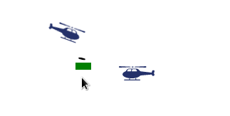

# Cursor Attack

Have you ever though that nowadays websites are too boring? Or even to easy?

Well, this is the solution for you! 
No one will ever be bored again on your website, because now helicopters will attack your cursor!




## How to use

1. Just add the following code to your website:

    Either via jsDelivr:
    
    ```html
    <script src="https://cdn.jsdelivr.net/gh/beniox/cursorAttack/script.js"></script>
    ```
    
    or via downloading the script:
    
    ```html
    <script src="script.js"></script>
    ```

2. And then call the function:

    ```html
    <script>
        const game = new Game();
        game.start();
    </script>
    ```